<h1>Name : Food Order App Server</ha>

<h3>Development Tools &Technologies</h3>
<ul>
  <li>Java</li>
  <li>XML</li>
  <li>Firebase</li>
  <li>Google Location Service</li>
  <li>Google Places</li>
</ul>

<h3>Database</h3>
<ul>
  <li>SQLite</li>
  <li>Firebase</li>
</ul>

<h3>Using IDE for project development</h3>
 Android Studio 3.1

<h3>Using Library</h3>
 <ol>
  <li>FButton : For responsiv Button design</li>
  <li>MaterialEditText : For responsiv EditText design</li>
  <li>Picasso : Powerful image downloading and caching library for Android</li>
  <li>firebase-auth : For user authentication</li>
</ol>

<h3>Project Features</h3>
<ol>
  <li>Login option for Authority no registration option</li>
  <li>Firebase Authentication</li>
  <li>Create, Update and Delete different type of food menu</li>
  <li>Add different type of food under a menu item</li>
  <li>Create, Update and Delete food item</li>
</ol>

<h2>Authority SignIn option and Main Screen</h2>

    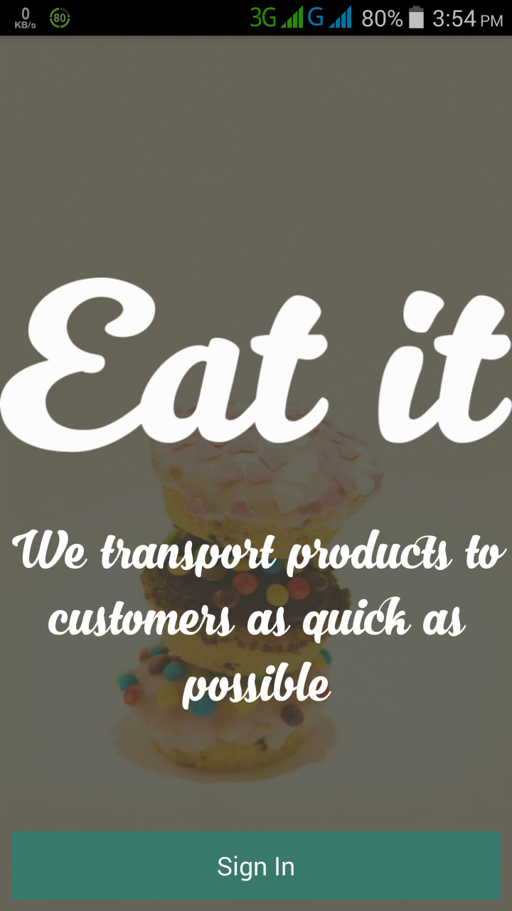
    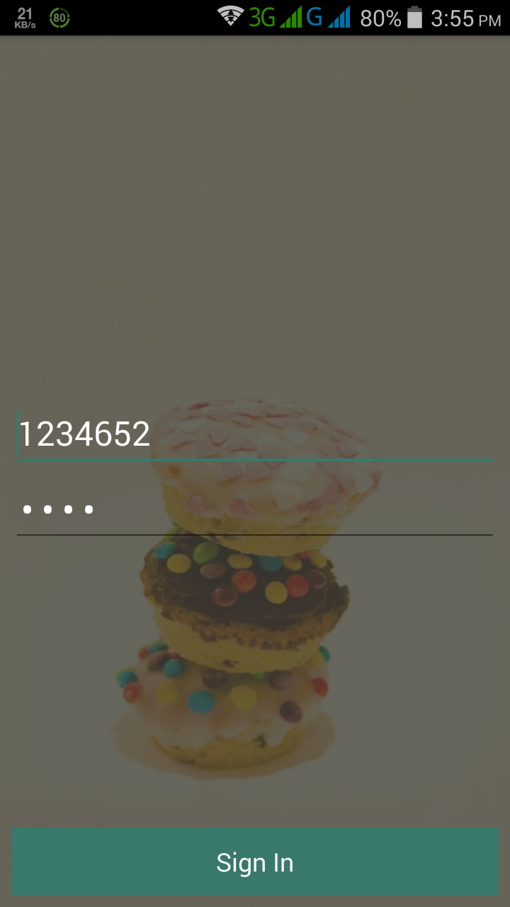
    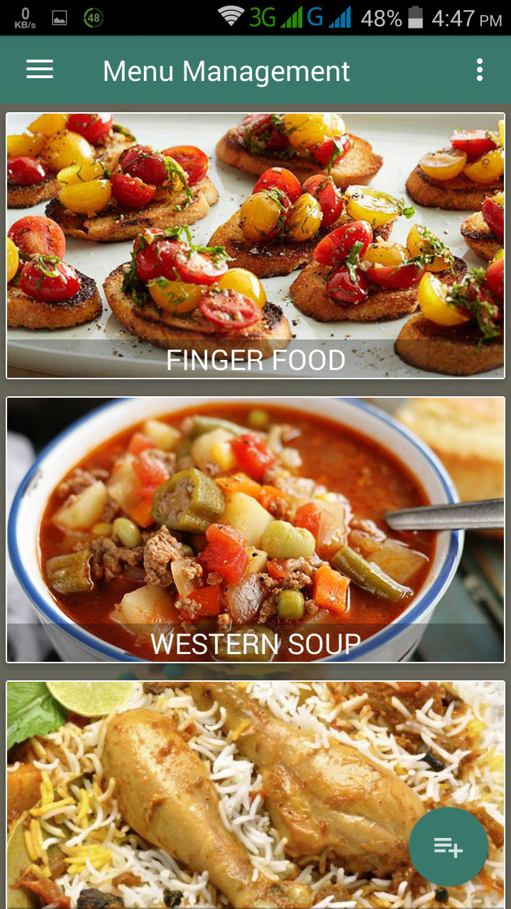

<h2>Add Menu Item</h2>

    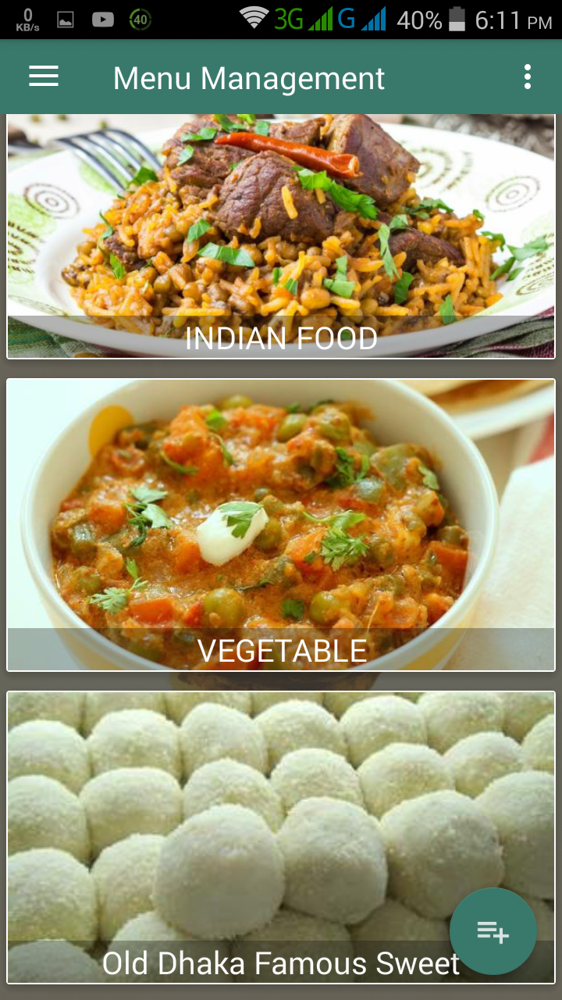
    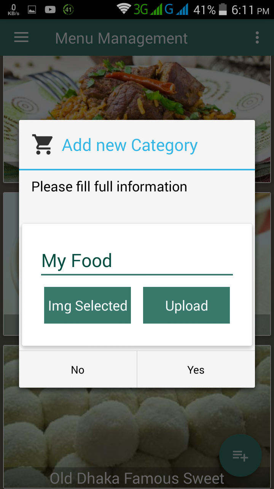
    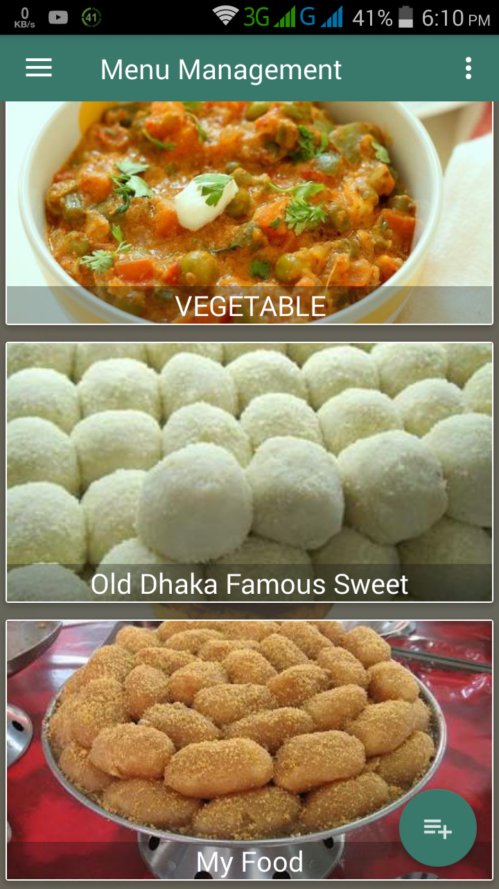

<h2>Update Menu Item</h2>

    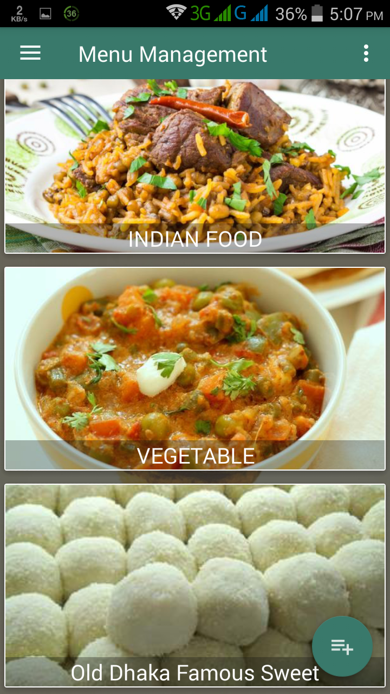
    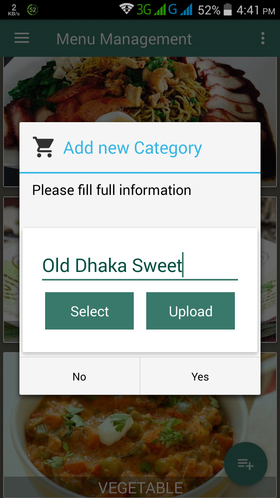
    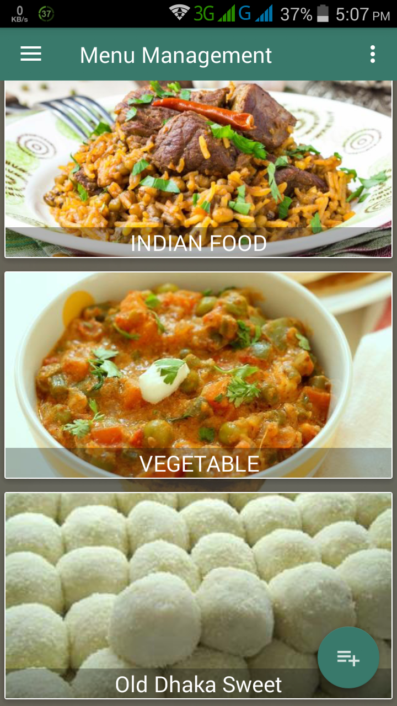

<h2>Delete Menu Item</h2>

    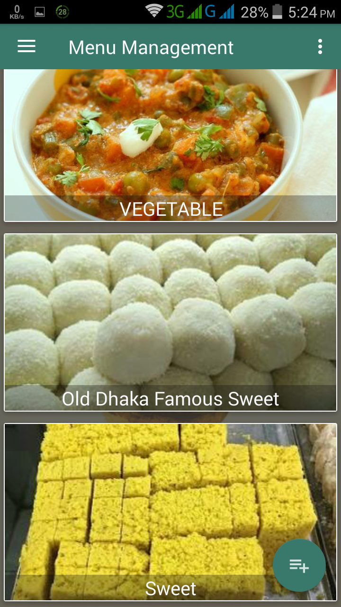
    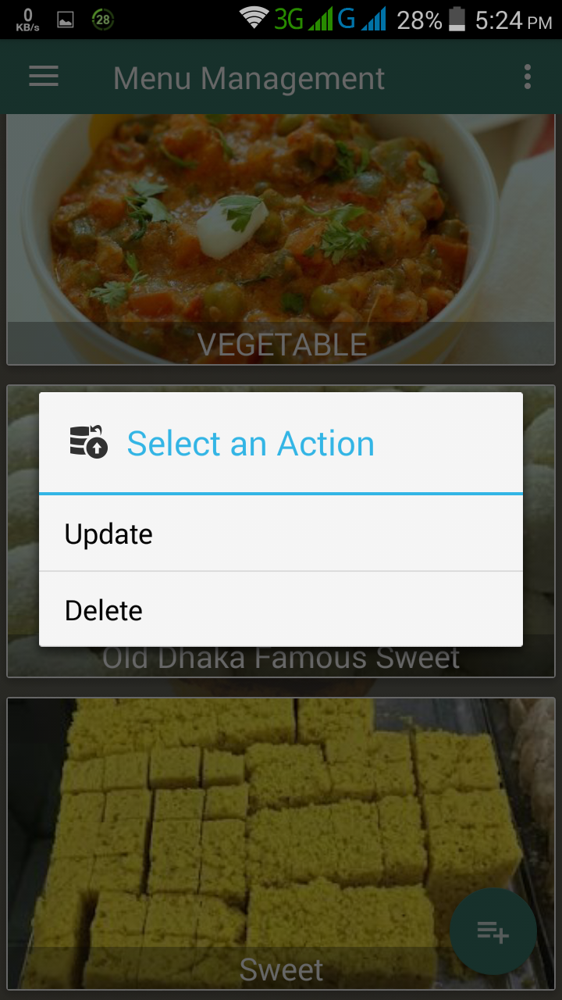
    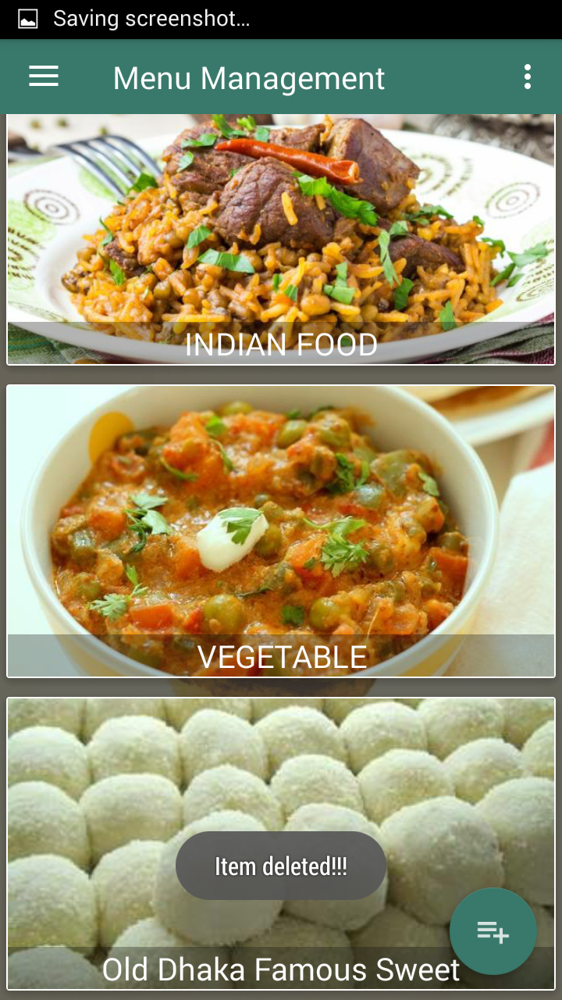

<h2>Add Food Item Under Menu Item</h2>

    
    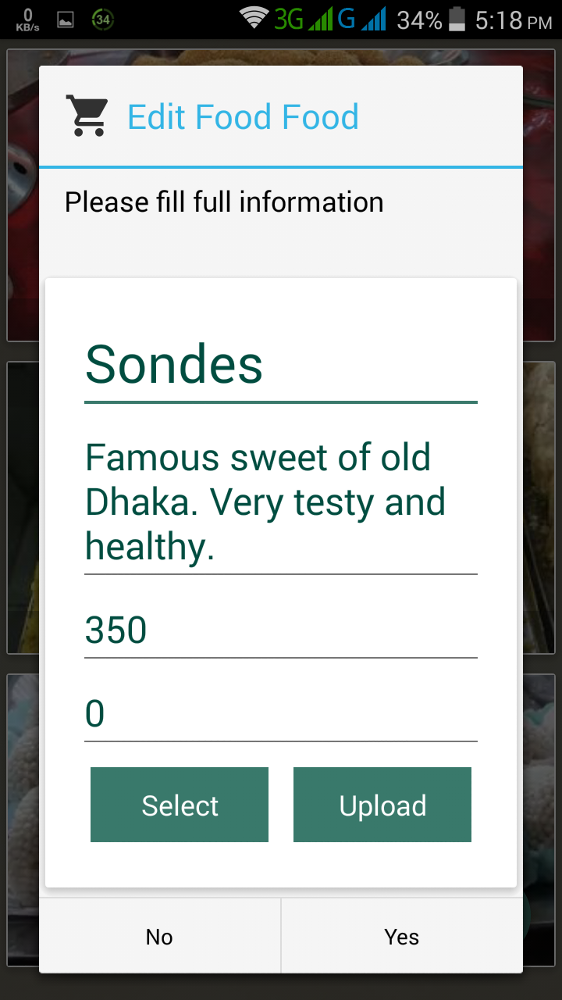
    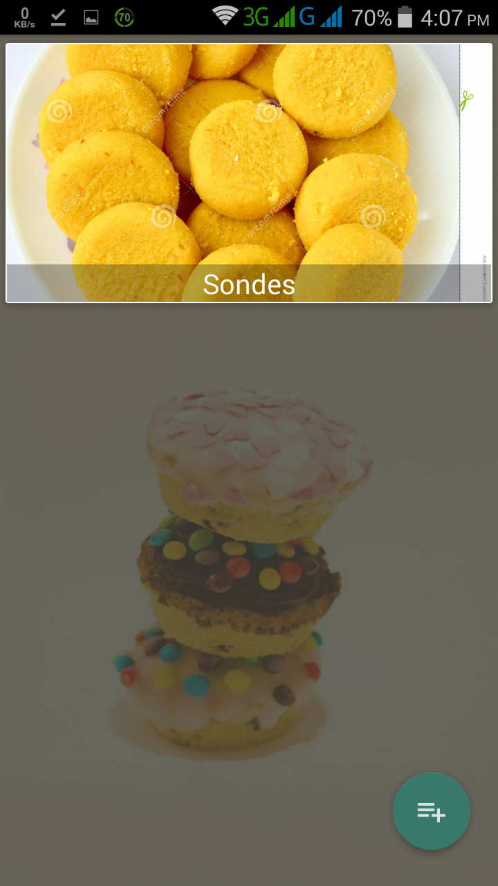

<h2>Add Food Item Under Menu Item</h2>

    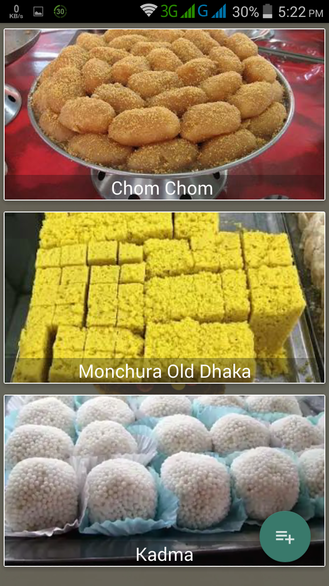
    
    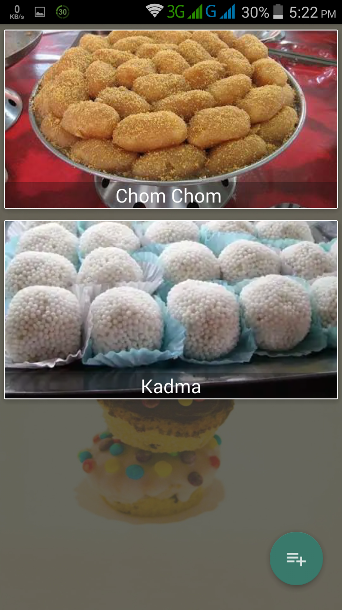

<h2>All Information Store in Database</h2>

    

